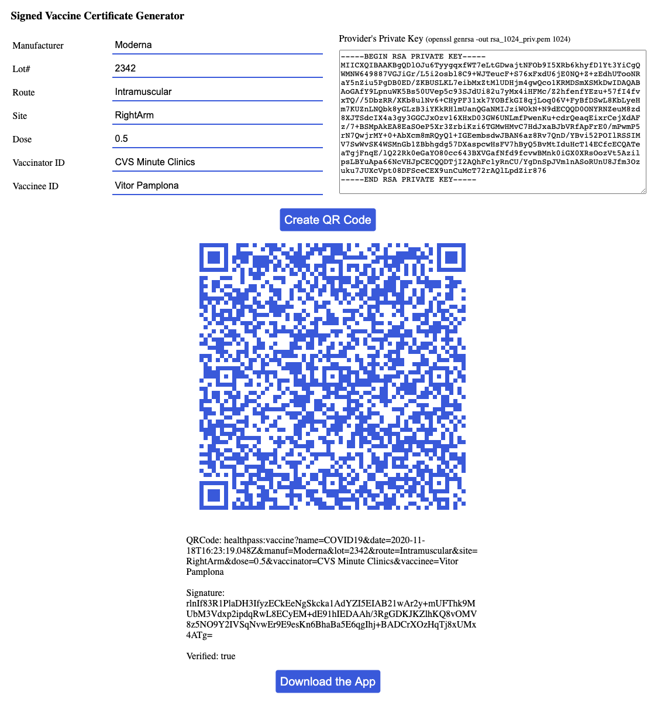

# URI-based Verifiable Credentials Demos

This repository hosts a set of demos to sign and verify QR-based credentials created with the [PathCheck's URI specification](https://github.com/Path-Check/paper-cred) in multiple languages. Demos are available for in HTML+JavaScript, Ruby, Java, Python and Shell Script, computing locally. 



# Try it out!

* [Signer and Verifiers in Static HTML/JavaScript](https://github.pathcheck.org/index.html)

# Run locally: 

The following scripts cryptographically sign and verify hardcoded payload you will find in the code. They were designed to look similar among each other and facilitate developer training as opposed to the best version they could be in each language. 

## Python 

See it [here](https://github.com/Path-Check/paper-cred-demo/blob/main/verify.py). 

Clone this Repository
```
git clone https://github.com/Path-Check/paper-cred-demo
```

Install the dependencies: 

```
pip3 install ecdsa
pip3 install dnspython
```

and run with

```
python verify.py
```

# Ruby

See it [here](https://github.com/Path-Check/paper-cred-demo/blob/main/verify.rb). 

Clone this Repository
```
git clone https://github.com/Path-Check/paper-cred-demo
```

Install the dependencies: 

```
gem install base32
```

and run with

```
ruby verify.rb
```

# Shell Script

See it [here](https://github.com/Path-Check/paper-cred-demo/blob/main/verify.sh). 

Clone this Repository
```
git clone https://github.com/Path-Check/paper-cred-demo
```

Give permissions:  
```
chmod 777 verify.sh
```

and run with
```
./verify.sh
```

# Java

See it [here](https://github.com/Path-Check/paper-cred-demo/blob/main/verify.java). 

Clone this Repository
```
git clone https://github.com/Path-Check/paper-cred-demo
```

and run with
```
javac -classpath libs/commons-codec-1.15.jar verify.java 
java -classpath libs/commons-codec-1.15.jar:. verify
```